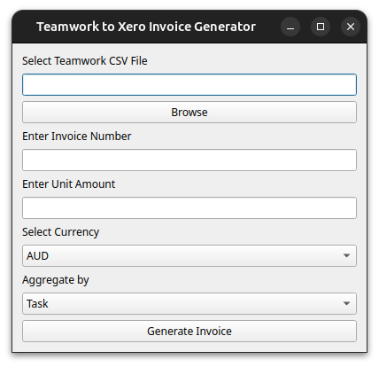

# Teamwork logs to Xero invoices

This tool is to make it easier to convert Teamwork timelogs into Xero invoices for you to send to clients.

## Install

1. Clone the repository.
2. Create virtual Python environment `python3 -m venv .venv`.
3. Install requirements in environment.  
    a. Activate environment `source .venv/bin/activate`.  
    b. Run install `python3 pip install -r requirements.txt`.

## Usage

1. Download the required time logs from Teamwork as a CSV file.
2. Run the application `python3 teamworkToXero.pyw`.
3. Select the teamwork timelogs csv file.
4. Fill in the remaining fields (Invoice number, unit amount, currnecy, and aggregation option).
5. Click "Generate Invoice". The file is saved in the same directory as the script.
6. Import the invoice into Xero.
